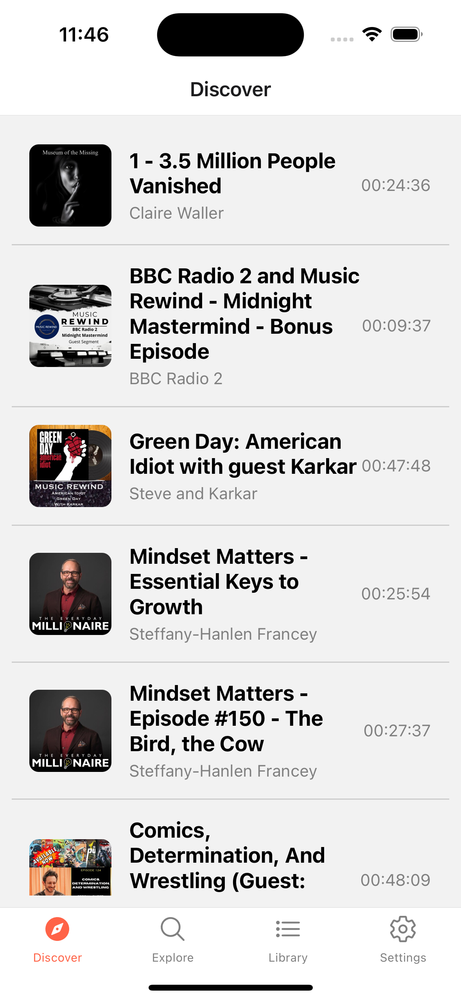
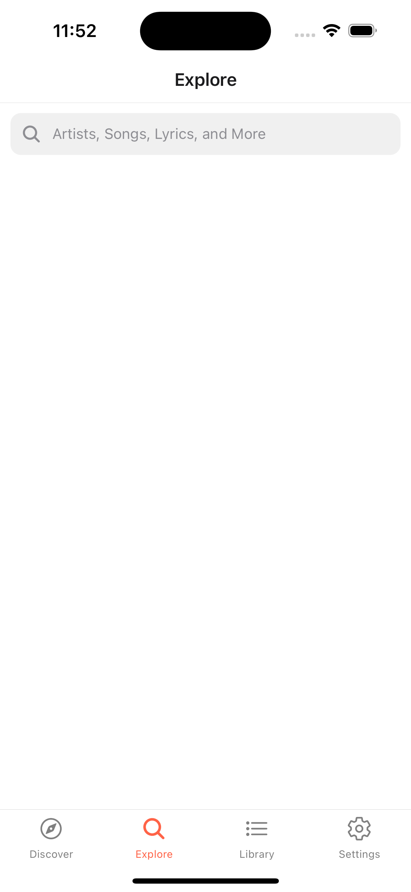
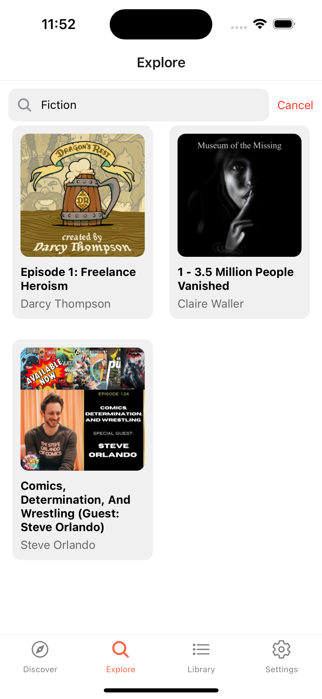
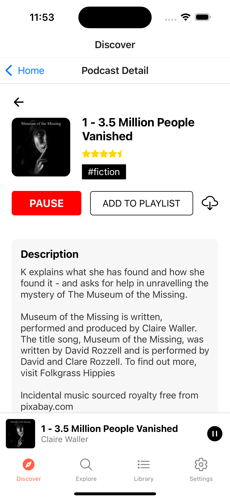

---

# 🎧 Podcast App

Welcome to the Podcast App! Discover, explore, and listen to your favorite podcasts with an intuitive and sleek user interface designed for an enhanced podcast listening experience. This README outlines the features, screenshots, and instructions for navigating the app.

## 🚀 Features

- **Discover Podcasts:** Stay up-to-date with the latest podcasts across various genres on the "Discover" tab.
- **Explore New Content:** Use the search functionality to explore new podcasts, artists, and shows with ease.
- **Podcast Detail Page:** View detailed descriptions, add episodes to your playlist, and download them for offline listening.
- **Mini Player:** Enjoy seamless playback with the mini player that appears at the bottom of the screen while browsing other sections of the app.
- **Playlists and Downloads:** Curate your personal playlist and download your favorite episodes for offline listening.

## 📱 Screenshots

### Discover Screen
The "Discover" tab showcases a list of trending podcasts. Users can scroll through a variety of episodes, view podcast durations, and start playing right away.

<div style="display: flex">
    
    
</div>

### Explore Screen
In the "Explore" tab, users can search for podcasts by keywords. Results are displayed in a clean grid format with eye-catching album art.

<div style="display: flex">
    
    
</div>

### Podcast Detail Screen
The podcast detail page allows users to see the description of the podcast episode, add episodes to their playlist, and download them for offline listening. Users can also rate podcasts and view other metadata.

<div style="display: flex">
    
</div>

## 🎯 How to Use

1. **Discover Podcasts:** Browse through trending episodes in the *Discover* tab.
2. **Search for Podcasts:** Use the *Explore* tab to search by podcast titles, artists, or keywords.
3. **Play Podcasts:** Tap on a podcast to view details, play, pause, or add it to your playlist.
4. **Download and Add to Playlist:** Save episodes for offline listening by using the download button, or simply add them to your playlist for later.
5. **Mini Player:** Continue browsing the app with the mini player available at the bottom of the screen.

## 🛠️ Installation

To get started with the app:

1. Clone the repository:
   ```bash
   git clone https://github.com/anshuunity/frontend.git
   ```
2. Install the dependencies:
   ```bash
   cd frontend
   npm install
   ```
3. Run the app:
   ```bash
   npm start
   ```

## 💡 Future Features

- Enhanced recommendations based on listening history.
- Integration with multiple streaming platforms.
- Social sharing of podcasts and playlists.

## 🎉 Conclusion

Enjoy the journey of discovering amazing podcasts. This app is your perfect companion for staying entertained and informed. Feel free to explore all features, and let us know how we can improve!

---

Keep up the amazing work! Your app looks fantastic so far! 🌟
